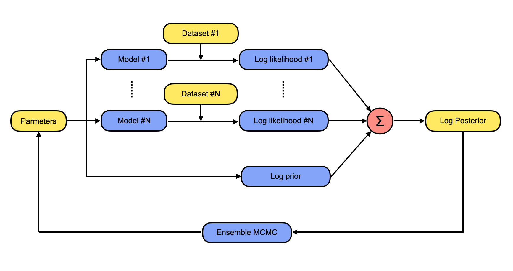

:orphan:

How to think in appletree
=========================

To understand the structure of appletree, it's always helpful to keep an exemplar problem in mind.
Think about that we wanna do a combined fitting, where multiple sets of calibration data need to 
be fit simultaneously. We have some model, i.e. parametrization of the physics and detector responses, 
and we have some prior knowledge on the parameters, but we do not know how much the calibration data
favors the parametrization as well as the prior knowledge. Appletree solves this kind of problem in a
Bayesian way, as shown in the following plot

For given parameters, which can be physics parameters or detector parameters, the models for each
calibration can be compared with the data, to give log likelihood. Then all log likelihoods are summed
up together with log prior as the log posterior. Now we use an affine invariant MCMC ensemble sampler
to sample from this posterior distribution. After sufficient iterations of sampling, we can choose a
point estimator on the parameters as the "best-fit".

The idea of appletree is quite simple, but there are several things need special attention. First, the
model is usually very hard to express in an analytical form, thus the model is usually realized by doing
simulations. Second, models can be different to describe different calibration data, e.g. ER model 
and NR model etc. Last, the dataset is usually not pure, meaning that it's consist of events from different
mechanism, which could be AC, wall events.

This exemplar problem helps us understand the structure of appletree. In appletree, there are four
important concepts:

    - **Plugin**: the smallest simulation unit.
    - **Component**: the ensemble of plugins as a whole simulation.
    - **Likelihood**: a class that sums up all components and calculates likelihood.
    - **Context**: the whole fitting manager that sums all log likelihoods and log prior and runs fitting.

Think about a Rn220-Ar37 combined fitting. There will be two **likelihoods**, one for Rn220 and one for Ar37.
In Rn220 likelihood, the model is consist of **components** of ER, AC, wall. And **plugins** can be quanta
generation, DPE effect of PMT etc.
